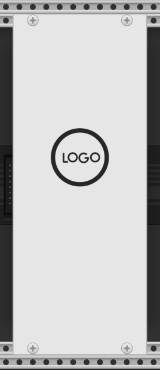
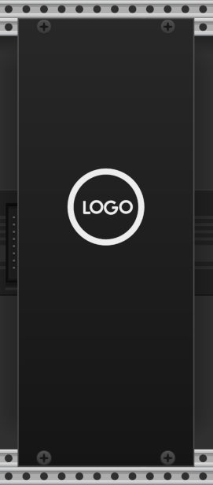

# Generic Blank

Generic Blank is a template repo for a VCV Rack plugin.
It is designed as an alternative to the Rack tutorial.
It avoids some of the stumbling blocks and limitations of the tutorial that some newcomers encounter when first trying to make a VCV Rack plugin.

[Release notes](doc/release-notes.md)

Generic Blank is licensed under the [MIT license](./LICENSE).
You may freely copy this project and use it as the basis for your plugin, following the steps outlined below.
If this helped you, attribution in your repo's README is appreciated.

This plugin contains only a blank panel module.
It _does not_ have any inputs, outputs, presets, extenders, or do any Digital Signal Processing (DSP).

It _does_ provide a building, working, and solid starting point for a VCV Rack plugin.

The Generic Blank looks like this, in the default light panel, and when the Rack "Prefer dark panels" setting is enabled:

 

Some of the basic framework you'll need for a more functional module are present as comments.
If you want something more than just a blank plugin, then you can follow the Rack plugin development guide
or clone any existing module that is open source to use a reference.
[Fundamental](https://github.com/VCVRack/Fundamental) is a good place to start.

If you encounter a problem with this code or documentation, please open an issue in this repo.
You are responsible for any plugin you make.
If you need help with GenericBlank or building and coding a Rack plugin, [VCV Community - Development ](https://community.vcvrack.com/c/development) or the VCV Rack Discord are friendly places to go.

## Building

Before you can build this plugin, you must set up a Rack development environment following the guide at [VCV Rack Plugin Development](https://vcvrack.com/manual/PluginDevelopmentTutorial).
When using Generic Blank, you **_do not_** use `Helper.py`.
When following the linked Rack guide, skip the _Creaing your template plugin_ and _Creating panels_ sections, but **_do_** read the [Panel Guide](https://vcvrack.com/manual/Panel).

I highly recommend [building Rack](https://vcvrack.com/manual/Building#Building-Rack) from source instead of using the Rack SDK.
This makes the source code available for reading and understanding how Rack works.
The Rack API documentation is generated from the source, so by cloning Rack you also have the documentation with the actual code for searching and reference.

It also makes debugging your module easier.
You can step through how Rack interacts with your module during it's lifecycle in a patch.
The dev cycle of editing code, building, and running is faster with a simple `make`,
and avoiding the packaging and deployment involved in using `make install` with the Rack SDK.

You can make a new GitHub repo for yourself using GenericBlank as a template.
Click the **Use this template** button and choose **Create a new repository**.
You can also download as a zip and unpack all the files to a folder in your Rack development `plugins` folder.

After setting up your copy of GenericBlank, make sure that you can build and run it before you make any changes.
If you aren't able to build and run for some reason, you can ask for help on the [GenericBlank community thread](https://community.vcvrack.com/t/getting-started-using-genericblank-by-d).

## Next steps

Once you've verified that GenericBlank builds and runs without any changes, you can transform it into _your_ module.

To make it your own:

1. Edit plugin.json to fill in the particulars of your plugin slug and name, _module_ slug(s) and name(s), your brand and company info, the kind of license you want to use, and so on. See [Plugin Manifest](https://vcvrack.com/manual/Manifest) for the VCV Rack requirements. These details MUST be different than what appears in this repo.

2. If you change the plugin slug in `plugin.json`, you must change the `"blank"` string in this line in `src/Blank.cpp` to match:

   ```cpp
   Model *modelBlank = createModel<BlankModule, BlankModuleWidget>("blank");
   ```

   Now you're ready to build your plugin, run Rack, and see if it's working. If all is well, you can take the final step.

3. Edit `res/Blank.svg` and `res/Blank-dark.svg` to give your blank module it's unique appearance. It's worthwhile reviewing the VCV Rack [Panel Guide](https://vcvrack.com/manual/Panel) for guidance on the design of the panel.

If you want to publish your module to the library, see the information at the end of the [Plugin Tutorial](https://vcvrack.com/manual/PluginDevelopmentTutorial).

## Automated builds

This project includes Bloodbat's build image and GitHub action to build the project for all the platforms supported by Rack: Linux, Max and Windows.
Each time you push to Github, the plugin is built for the platforms supported by VCV Rack: Linux, both Mac variants (ARM and x64), and Windows.
When a tag starting with 'v' such as 'v2.1.0' is pushed to main, a Release for that version is published.
When a tag named "Nightly" exists in the repo, each push to main builds the plugin.
When the build is successful, it publishes a Nightly release.

Each platform build can generate unique warnings and errors.
If you plan to submit your plugin to the Rack library, it will be required to build and run on all platforms.
The action builds your plugin but doesn't run it.
For help testing on other platforms, put a call out to the community.
You'll usually find a volunteer to help (especially if your plugin is interesting).

## PS

I hope this is useful to you.
If you have questions or a suggestion, you can open an issue or dicsussion in Github,
or post to the [Getting started using GenericBLank (by #d)](https://community.vcvrack.com/t/getting-started-using-genericblank-by-d) thread on the VCV Rack Community.

:- Paul Dempsey (aka pachde)
