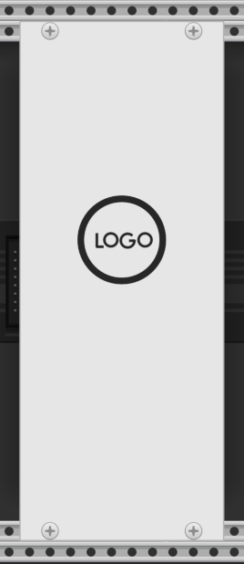
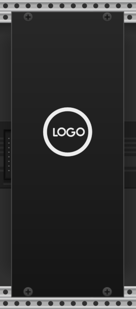

# Blank

The **Blank** module in the **Generic Blank** plugin is a basic blanking plate module.
It doesn't have any knobs, switches, sliders, or inputs and outputs.
It only has standard fixed panel SVGs for Light and Dark ("Prefer dark panels") Rack modes.

| Light | Dark |
| :--: | :--: |
|  |  |

If this module had inputs, outputs, and other controls, I like to add a summary of what each one does.
A table like this gives something easily scanned for quick reference.

| Widget | Name | Description |
| -- | :--: | -- |
| Knob | Some | What the "Some" knob does. |
| Input | A | What the A input is for. |
| Output | Q | What the Q output is for. |

If not everything is labelled, working from left-to-right, top-to-bottom is often a good way to describe your controls.

Describing the module overall and documenting each control, input, and output is the basic minimum that a module documentation should include.